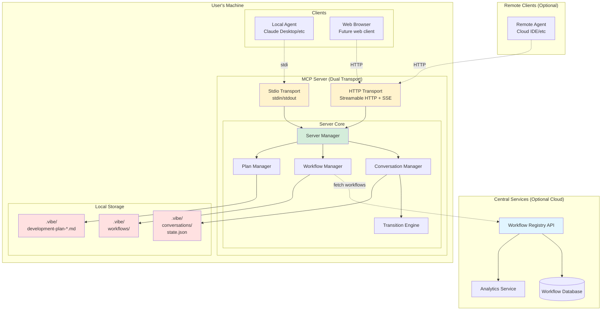
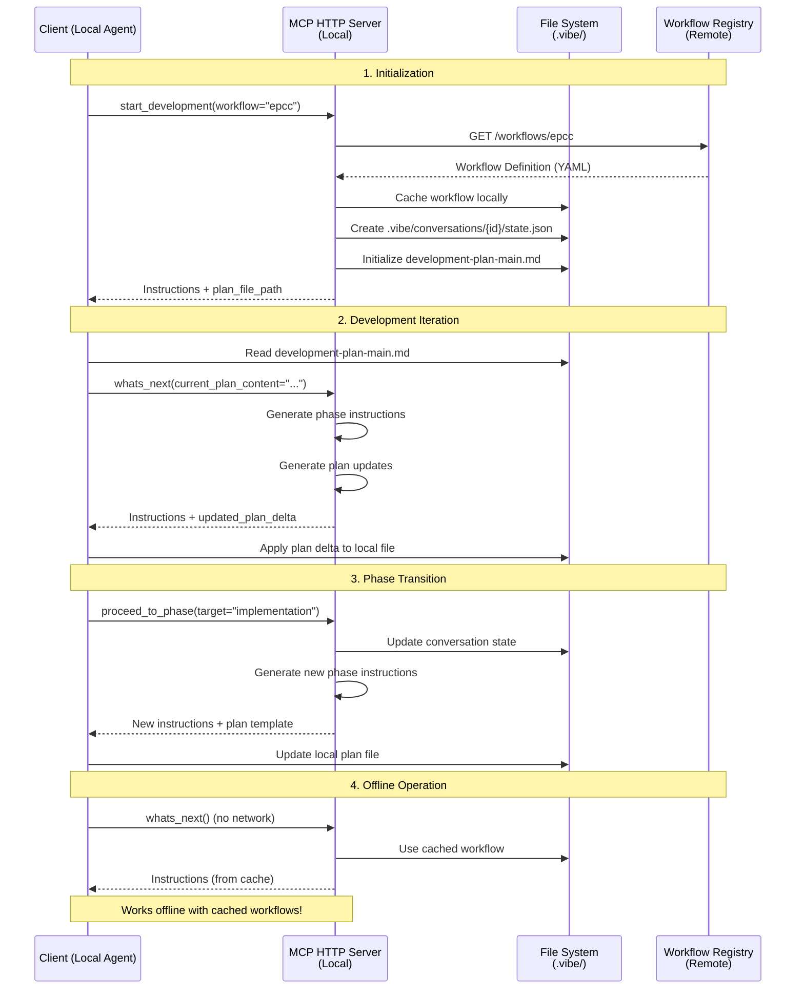
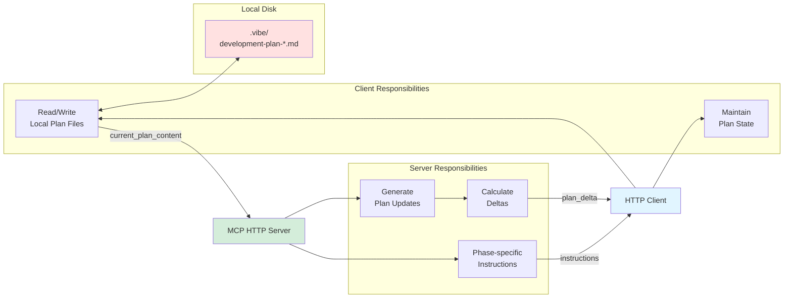
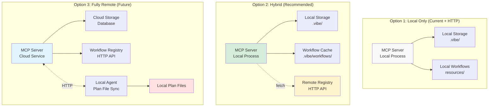
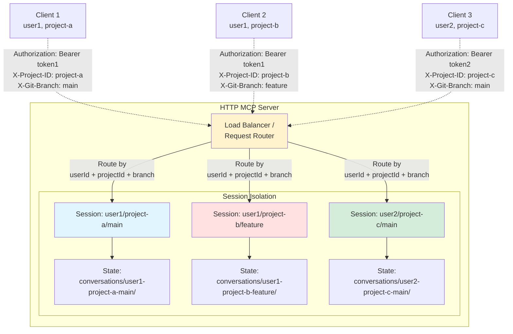
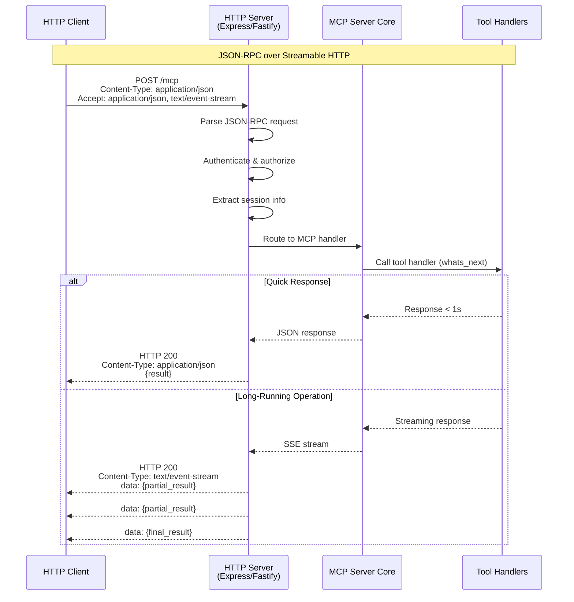
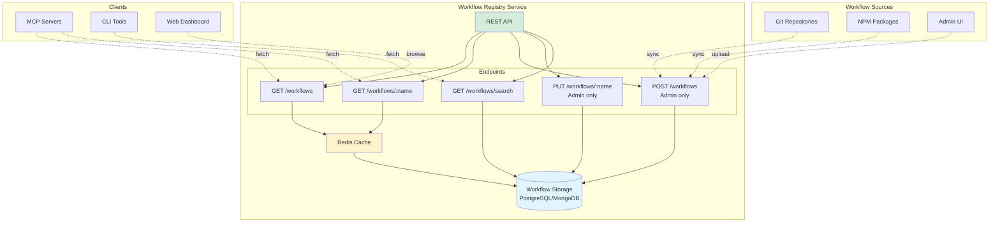
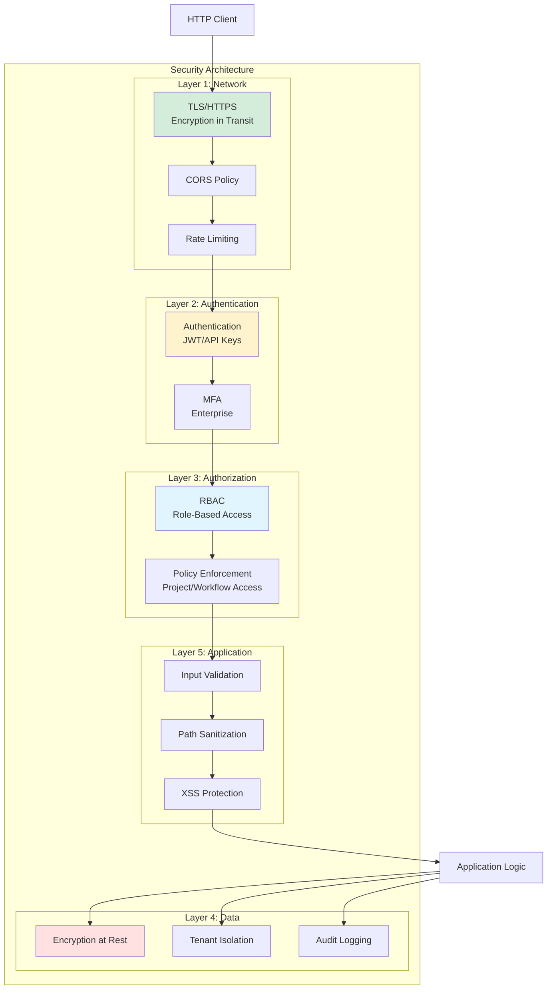

# MCP over HTTP - Architecture Diagrams

## Recommended Hybrid Architecture



## Data Flow: Local Plan Files with Remote Workflows



## Workflow Provisioning - Multi-Source Strategy

```mermaid
graph TB
    subgraph "MCP Server - Workflow Resolution"
        WM[Workflow Manager]

        subgraph "Priority 1: Project Local"
            L1[.vibe/workflows/]
        end

        subgraph "Priority 2: Organization Registry"
            L2[HTTP Workflow Registry<br/>company.com/workflows]
        end

        subgraph "Priority 3: NPM Packages"
            L3[@company/workflow-*<br/>node_modules/]
        end

        subgraph "Priority 4: Built-in"
            L4[resources/workflows/<br/>Built-in YAML files]
        end

        WM -->|1. Check| L1
        WM -->|2. Check if not found| L2
        WM -->|3. Check if not found| L3
        WM -->|4. Fallback| L4
    end

    L1 -->|Found| WF[Workflow Definition]
    L2 -->|Found| WF
    L3 -->|Found| WF
    L4 -->|Always available| WF

    style WF fill:#d4edda
    style L1 fill:#ffe1e1
    style L2 fill:#e1f5ff
    style L3 fill:#fff3cd
    style L4 fill:#f8f9fa
```

## Plan File Management - HTTP Mode



## Deployment Options Comparison



## Session Management - Multi-Tenancy



## HTTP Transport Implementation



## Workflow Registry API



## Security Layers



---

**Legend:**
- 🟢 Green: Recommended/Primary components
- 🔵 Blue: Remote/Cloud components
- 🔴 Red: Local storage (user's disk)
- 🟡 Yellow: Transport/Communication layers
- ⚪ Gray: Optional/Fallback components
