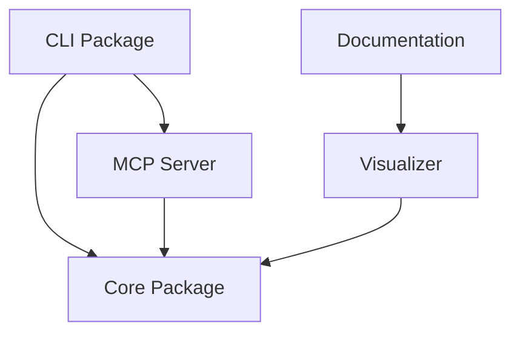
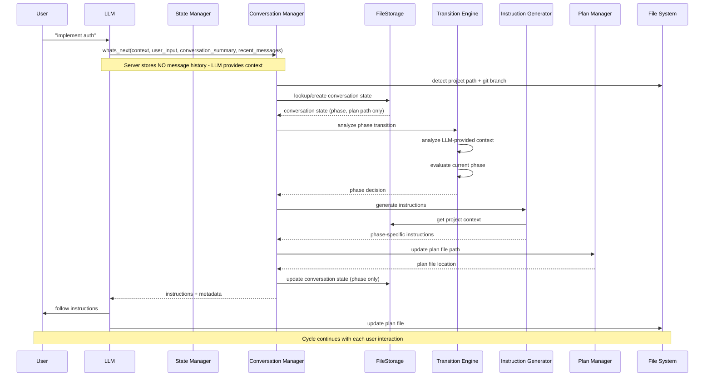

# Architecture

This document provides detailed information about the Responsible Vibe MCP Server architecture, components, and design principles.

## Information Architecture

Responsible-Vibe-MCP implements a **plan-file-centric information architecture** with clear separation of responsibilities across different components:

### Information Component Responsibilities

| **Component**         | **Responsibility**        | **Information Type**    | **Maintenance** |
| --------------------- | ------------------------- | ----------------------- | --------------- |
| **System Prompt**     | Generic workflow guidance | How to use the system   | Static          |
| **Tool Descriptions** | Generic tool usage        | What each tool does     | Static          |
| **Tool Responses**    | Dynamic phase guidance    | What to do right now    | Dynamic         |
| **Plan File**         | Project context & tasks   | What we've done/decided | LLM-maintained  |

### Core Principles

#### **1. Static Components Stay Generic**

- **System Prompt**: Workflow-agnostic instructions on tool usage patterns
- **Tool Descriptions**: Generic tool purposes without hardcoded phase names
- **Benefit**: Works with any workflow (built-in or custom)

#### **2. Dynamic Guidance Through Tool Responses**

- **Tool responses provide**: Phase-specific instructions, user interaction guidance, completion criteria
- **Plan-file-referential**: "Check your plan file's Design section for current tasks"
- **Context-aware**: Adapts to current project state and progress

#### **3. Plan File as Single Source of Truth**

- **Contains**: Task lists per phase, key decisions, project context
- **Structure**: Simple, LLM-maintainable (no complex dynamic elements)
- **Purpose**: Task tracker and decision log, not workflow guide

#### **4. Clear Separation of Concerns**

```
System Prompt: "How to use tools"
Tool Descriptions: "What tools do" (generic)
Tool Responses: "Check plan file section X, work on tasks Y, Z" (specific)
Plan File: "[ ] Task 1  [x] Task 2  Decision: chose approach A" (tracking)
```

### Benefits of This Architecture

- **✅ Workflow Flexibility**: Static components work with any workflow type
- **✅ Maintainable**: No hardcoded workflow information in static descriptions
- **✅ User Transparency**: Users see the same plan file the LLM follows
- **✅ Consistent Guidance**: All dynamic instructions come from tool responses
- **✅ Simple Maintenance**: LLM only updates simple task lists and decisions

## Monorepo Architecture

Responsible-Vibe-MCP is organized as a monorepo with clear package separation and dependency management:

### Package Structure

```
responsible-vibe-mcp/
├── packages/
│   ├── core/                    # @responsible-vibe/core
│   │   ├── src/                 # Core functionality (state machine, workflow management, database)
│   │   └── dist/                # Compiled TypeScript output
│   ├── mcp-server/              # @responsible-vibe/mcp-server
│   │   ├── src/                 # MCP server implementation and tool handlers
│   │   └── dist/                # Compiled server with bundled dependencies
│   ├── cli/                     # @responsible-vibe/cli
│   │   ├── src/                 # CLI tools and main entry point
│   │   └── dist/                # CLI executables
│   ├── visualizer/              # @responsible-vibe/visualizer
│   │   ├── src/                 # Vue.js workflow visualization component
│   │   └── dist/                # Built component for reuse
│   └── docs/                    # @responsible-vibe/docs
│       ├── .vitepress/          # VitePress documentation site
│       └── dev/                 # Developer documentation
├── resources/                   # Workflow definitions and templates
└── pnpm-workspace.yaml         # Monorepo configuration
```

### Package Dependencies



### Key Architectural Benefits

- **🔧 Separation of Concerns**: Each package has a single, well-defined responsibility
- **📦 Independent Deployment**: Packages can be built and tested independently
- **🔄 Workspace Dependencies**: Development uses workspace imports for type safety
- **📱 Dual Import Strategy**: Published packages use relative imports for Node.js compatibility
- **🎯 CLI as Main Entry**: CLI package serves as the main entry point, routing to MCP server or CLI functionality

### Build System

- **Turbo**: Orchestrates builds across packages with dependency awareness
- **TypeScript**: Shared configuration via `tsconfig.base.json`
- **PNPM Workspaces**: Efficient dependency management and linking
- **Independent Testing**: Each package can run its own test suite

### Publishing Strategy

The monorepo publishes as a single `responsible-vibe-mcp` package containing all built packages, maintaining backward compatibility while providing the benefits of modular development.

## Static Architecture

```mermaid
graph TB
    subgraph "Vibe Feature MCP Server"
        CM[Conversation Manager]
        TM[Transition Engine]
        IM[Instruction Generator]
        PM[Plan Manager]
        FS[(FileStorage)]
    end

    subgraph "Development Phases"
        IDLE[Idle]
        REQ[Requirements]
        DES[Design]
        IMP[Implementation]
        QA[Quality Assurance]
        TEST[Testing]
        COMP[Complete]
    end

    subgraph "Persistent Storage"
        STATEFILE[.vibe/conversations/{id}/state.json]
        LOGFILE[.vibe/conversations/{id}/interactions.jsonl]
        PF[Project Plan Files]
        GIT[Git Repository Context]
    end

    subgraph "LLM Client"
        LLM[LLM Application]
        USER[User]
        CWD[Current Working Directory]
    end

    USER --> LLM
    LLM --> CM
    CM --> FS
    CM --> TM
    TM --> IM
    IM --> PM

    FS --> STATEFILE
    FS --> LOGFILE
    PM --> PF
    CM --> GIT

    IDLE --> TM
    REQ --> TM
    DES --> TM
    IMP --> TM
    QA --> TM
    TEST --> TM
    COMP --> TM

    IM --> LLM
```

## Core Building Blocks

### 1. **Conversation Manager**

The Conversation Manager handles conversation identification, state persistence, and coordination between components.

**Responsibilities:**

- Generate unique conversation identifiers from project path + git branch
- Load and persist conversation state from/to database
- Coordinate state updates across components
- Handle conversation lifecycle (creation, updates, cleanup)
- Provide conversation-scoped state isolation
- Manage project-specific development context

**Key Features:**

- **Project-Aware Identification**: Uses absolute project path + current git branch as conversation identifier
- **Git Integration**: Automatically detects git branch changes and creates separate conversation contexts
- **Stateless Operation**: Does not store conversation history, relies on LLM-provided context
- **Multi-Project Support**: Handles multiple concurrent project conversations
- **State Validation**: Ensures state consistency and handles corrupted state recovery
- **Context Processing**: Analyzes LLM-provided conversation summary and recent messages

### 2. **Transition Engine**

The Transition Engine manages the development state machine and determines appropriate phase transitions.

**Responsibilities:**

- Analyze user input and conversation context
- Determine current development phase
- Evaluate phase completion criteria
- Trigger phase transitions based on conversation analysis
- Implement development state machine logic

**Key Features:**

- **Context Analysis**: Processes LLM-provided conversation summary and recent messages
- **Phase Detection**: Intelligently determines appropriate development phase
- **Transition Logic**: Implements rules for phase progression and regression
- **Completion Assessment**: Evaluates when phases are sufficiently complete
- **State Machine Management**: Handles the core development workflow logic

### 3. **Instruction Generator**

The Instruction Generator creates phase-specific guidance for the LLM based on current conversation state.

**Responsibilities:**

- Generate contextual instructions for each development phase
- Customize instructions based on project context and history
- Provide task completion guidance
- Generate plan file update instructions

**Key Features:**

- **Phase-Specific Guidance**: Tailored instructions for each development phase
- **Context-Aware Customization**: Adapts instructions based on project type and history
- **Task Management**: Provides clear guidance on task completion and progress tracking
- **Plan File Integration**: Ensures consistent plan file updates and maintenance

### 4. **Plan Manager**

The Plan Manager handles the creation, updating, and maintenance of project development plan files.

**Responsibilities:**

- Generate and maintain markdown plan files
- Track task completion and progress
- Manage plan file structure and content
- Handle plan file versioning per git branch

**Key Features:**

- **Markdown Generation**: Creates structured development plans in markdown format
- **Progress Tracking**: Maintains task completion status and project progress
- **Branch-Aware Plans**: Separate plan files for different git branches when needed
- **Template Management**: Consistent plan file structure across projects

### 5. **File-Based Persistence**

The persistence layer provides transparent, human-readable storage for conversation state and interaction logs.

**Storage Structure:**

```
.vibe/
  conversations/
    {conversationId}/
      state.json          - Conversation state (JSON)
      interactions.jsonl  - Interaction logs (one JSON per line)
```

**State File Format (state.json):**

- **conversationId**: Unique identifier based on project path + git branch
- **projectPath**: Absolute path to the project
- **gitBranch**: Current git branch name
- **currentPhase**: Current workflow phase
- **planFilePath**: Path to the development plan file
- **workflowName**: Name of the active workflow
- **gitCommitConfig**: Git commit behavior configuration (optional)
- **requireReviewsBeforePhaseTransition**: Review requirements flag
- **createdAt**, **updatedAt**: Timestamps

**Key Features:**

- **Transparent Storage**: Human-readable JSON files for easy inspection
- **Persistent State**: Survives server restarts and system reboots
- **Graceful Degradation**: Handles user file manipulation (edits, deletions)
- **Atomic Writes**: Uses temp file + rename pattern for data safety
- **Automatic Migration**: Detects and migrates legacy SQLite databases on first run
- **Isolated Storage**: Each conversation has its own directory

**Migration Support:**

The system automatically detects legacy SQLite databases (`conversation.sqlite` or `conversation-state.sqlite`) and migrates them to the file-based structure on first initialization. Original SQLite files are backed up with timestamps before migration.

## Dynamic Behavior



## Data Flow Architecture

### 1. **Conversation Identification Flow**

```
User Input → Project Detection → Git Branch Detection → Conversation ID Generation → FileStorage Lookup
```

### 2. **State Management Flow**

```
Conversation ID → State Retrieval → Context Analysis → Phase Determination → State Update → File Persistence
```

### 3. **Instruction Generation Flow**

```
Current Phase → Project Context → Conversation History → Instruction Template → Customized Instructions
```

### 4. **Plan File Management Flow**

```
Project Path → Branch Detection → Plan File Path → Content Generation → File Updates → Progress Tracking
```

## Key Architectural Principles

### 1. **Project-Centric Design**

- Each project maintains independent conversation state
- Git branch awareness enables feature-specific development tracking
- Plan files remain within project directories for easy access

### 2. **Persistent State Management**

- File-based storage ensures state survives server restarts
- Conversation history enables context-aware decision making
- Storage isolated per conversation in `.vibe/conversations/` directory
- Automatic migration from legacy SQLite databases

### 3. **Phase-Driven Workflow**

- Clear separation between development phases
- Phase-specific instructions guide LLM behavior
- Transition logic ensures appropriate workflow progression

### 4. **Conversation Continuity**

- Long-term memory across multiple LLM interactions
- Context preservation enables complex, multi-session development
- History tracking supports learning and improvement

### 5. **Git Integration**

- Branch-aware conversation management
- Separate development contexts for different features
- Integration with existing git workflows

### 6. **Flexible Documentation Architecture**

- **Optional Documentation**: Workflows can specify whether formal documentation is required
- **Conditional References**: Workflows adapt instructions based on document availability
- **Workflow-Specific Requirements**: `requiresDocumentation` metadata flag controls documentation enforcement
- **Backward Compatibility**: Existing workflows default to optional documentation

## Optional Documentation Architecture

The system supports flexible documentation requirements to accommodate both comprehensive and lightweight development approaches:

### Documentation Requirement Levels

| **Workflow Type** | **requiresDocumentation** | **Behavior**                                       | **Examples**                       |
| ----------------- | ------------------------- | -------------------------------------------------- | ---------------------------------- |
| **Comprehensive** | `true`                    | Documentation setup required before workflow start | greenfield, waterfall, c4-analysis |
| **Lightweight**   | `false` (default)         | Skip documentation setup, proceed directly         | epcc, minor, bugfix                |

## Scalability Considerations

### 1. **Multi-Project Support**

- Concurrent handling of multiple project conversations
- Isolated state prevents cross-project interference
- Efficient database indexing for fast project lookups

### 2. **Performance Optimization**

- SQLite provides fast local storage with minimal overhead
- Conversation state caching reduces database queries
- Efficient git branch detection minimizes system calls

### 3. **Storage Management**

- Automatic cleanup of old conversation states
- Plan file management within project boundaries
- Database maintenance and optimization capabilities

## Integration Points

### 1. **LLM Integration**

- Single `whats_next` tool interface
- JSON-based instruction delivery
- Context-aware response generation

### 2. **File System Integration**

- Plan file creation and management
- Project directory detection
- Git repository integration

### 3. **Development Tool Integration**

- Compatible with existing development workflows
- Non-intrusive plan file placement
- Standard markdown format for universal compatibility

## State Machine

The server operates as a state machine that transitions between development phases. While workflows typically follow a linear progression, **users can transition directly to any phase at any time** using the `proceed_to_phase` tool.

For a comprehensive reference of all state transitions, including detailed instructions and transition reasons, see [TRANSITIONS.md](./TRANSITIONS.md).

## Logging and Debugging

The server includes comprehensive logging with configurable levels for debugging, monitoring, and troubleshooting:

### Log Levels

- **DEBUG**: Detailed tracing and execution flow
- **INFO**: Success operations and important milestones (default)
- **WARN**: Expected errors and recoverable issues
- **ERROR**: Caught but unexpected errors

### Configuration

Set the log level using the `LOG_LEVEL` environment variable:

```bash
# Debug level (most verbose)
LOG_LEVEL=DEBUG npx tsx src/index.ts

# Production level
LOG_LEVEL=INFO node dist/index.js
```

### Log Components

- **Server**: Main server operations and tool handlers
- **FileStorage**: File operations and state persistence
- **Migration**: SQLite to file-based migration operations
- **ConversationManager**: Conversation context management
- **TransitionEngine**: Phase transition analysis
- **PlanManager**: Plan file operations

For detailed logging documentation, see [LOGGING.md](./LOGGING.md).

## Interaction Logging

Responsible Vibe MCP includes a comprehensive interaction logging system that records all tool calls and responses for debugging and analysis purposes:

### Logged Information

- **Tool Calls**: All calls to `whats_next` and `proceed_to_phase` tools
- **Input Parameters**: Complete request parameters for each tool call
- **Response Data**: Complete response data returned to the LLM
- **Current Phase**: Development phase at the time of the interaction
- **Timestamp**: When the interaction occurred
- **Conversation ID**: Which conversation the interaction belongs to

### Data Storage

All interaction logs are stored in JSONL format (one JSON object per line) in the `.vibe/conversations/{conversationId}/interactions.jsonl` file within your project. The data is stored without masking or filtering, as it is kept locally on your system.

**File Location**: `.vibe/conversations/{conversationId}/interactions.jsonl`

### Querying Logs

Logs can be accessed directly as JSONL files at `.vibe/conversations/{conversationId}/interactions.jsonl`. Each line is a valid JSON object representing one interaction. You can use standard text tools (`cat`, `grep`, `jq`) to analyze the logs.

**Example:**

```bash
# View all interactions for a conversation
cat .vibe/conversations/my-project-main-abc123/interactions.jsonl

# Filter by tool name
grep "whats_next" .vibe/conversations/my-project-main-abc123/interactions.jsonl

# Pretty-print with jq
cat .vibe/conversations/my-project-main-abc123/interactions.jsonl | jq .
```

**Note**: All interaction data is stored locally on your system and is never transmitted to external services.
